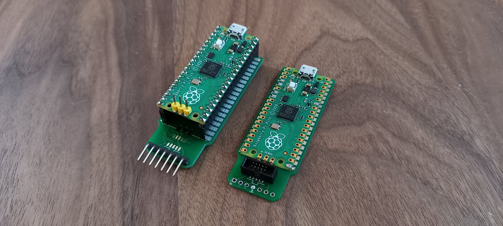
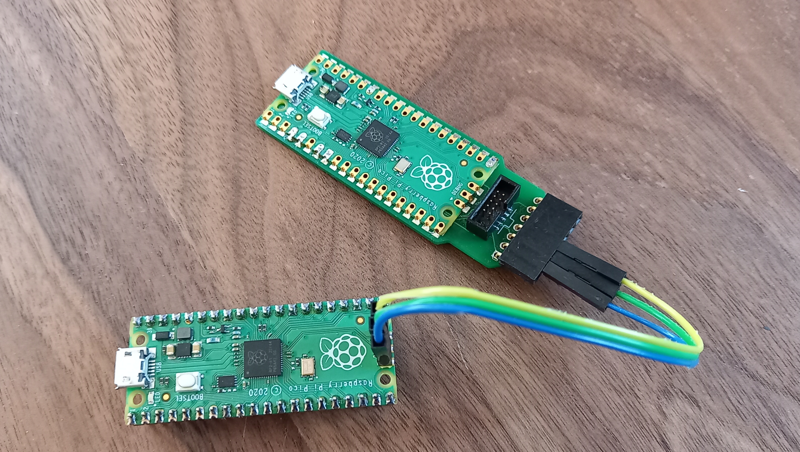

# picoprobe-pcb


If like me you love the Raspberry Pi Pico/RP2040, but your are not satisfied
with the available hardware debugging solution, this kit is for you ^^

This PCB is designed to turn a Pico into a nice debug probe using the
[PicoProbe software](https://github.com/raspberrypi/picoprobe).

# Usage

## Mounting options

There are two ways to mount a Raspberry Pi Pico on the Picoprobe-PCB. You can
either solder it directly for a slim/compact result (right), or use header to
be able to re-use the Pico on other projects (left).



## Install the Picoprobe software

 1. Either get the picoprobe `.uf2` binary from our release [here]() or compile
 it yourself from sources [here]().

 1. Hold the BOOTSEL button on the Pico, then connect to your computer using a
 micro USB cable.

 1. Drag and drop the UF2 file on to the RPI-RP2 drive.

 1. You should be good to go.

### Plug the picoprobe SWD pin to the Pico that you want to debug



### Build Raspberry Pi's opencod

```console
$ sudo apt install automake autoconf build-essential texinfo libtool libftdi-dev libusb-1.0-0-dev
$ git clone https://github.com/raspberrypi/openocd.git --branch picoprobe --depth=1 --no-single-branch
$ cd openocd
$ ./bootstrap
$ ./configure --enable-picoprobe
$ make -j4
```

### Run openocd

```console
$ ./src/openocd  -s tcl -f interface/picoprobe.cfg -f target/rp2040.cfg
Open On-Chip Debugger 0.10.0+dev-g18b4c35-dirty (2021-10-16-16:51)
Licensed under GNU GPL v2
For bug reports, read
        http://openocd.org/doc/doxygen/bugs.html
Info : only one transport option; autoselect 'swd'
Warn : Transport "swd" was already selected
adapter speed: 5000 kHz

Info : Hardware thread awareness created
Info : Hardware thread awareness created
Info : RP2040 Flash Bank Command
Info : Listening on port 6666 for tcl connections
Info : Listening on port 4444 for telnet connections
Info : clock speed 5000 kHz
Info : SWD DPIDR 0x0bc12477
Info : SWD DLPIDR 0x00000001
Info : SWD DPIDR 0x0bc12477
Info : SWD DLPIDR 0x10000001
Info : rp2040.core0: hardware has 4 breakpoints, 2 watchpoints
Info : rp2040.core1: hardware has 4 breakpoints, 2 watchpoints
Info : starting gdb server for rp2040.core0 on 3333
Info : Listening on port 3333 for gdb connections
Info : accepting 'gdb' connection on tcp/3333
Warn : target was in unknown state when halt was requested
target halted due to debug-request, current mode: Thread 
xPSR: 0x21000000 pc: 0x10008f64 msp: 0x20041fc0
Info : RP2040 B0 Flash Probe: 2097152 bytes @10000000, in 512 sectors
[...]
```

### Debug!

Now that openocd is connected, you can start debugging with GDB for instance.

```console
$ arm-eabi-none-gdb
(gdb) target extended-remote :3333
```
